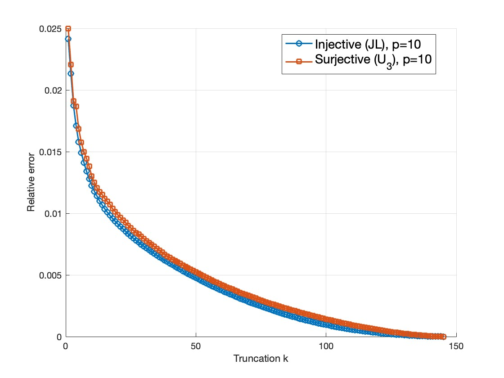
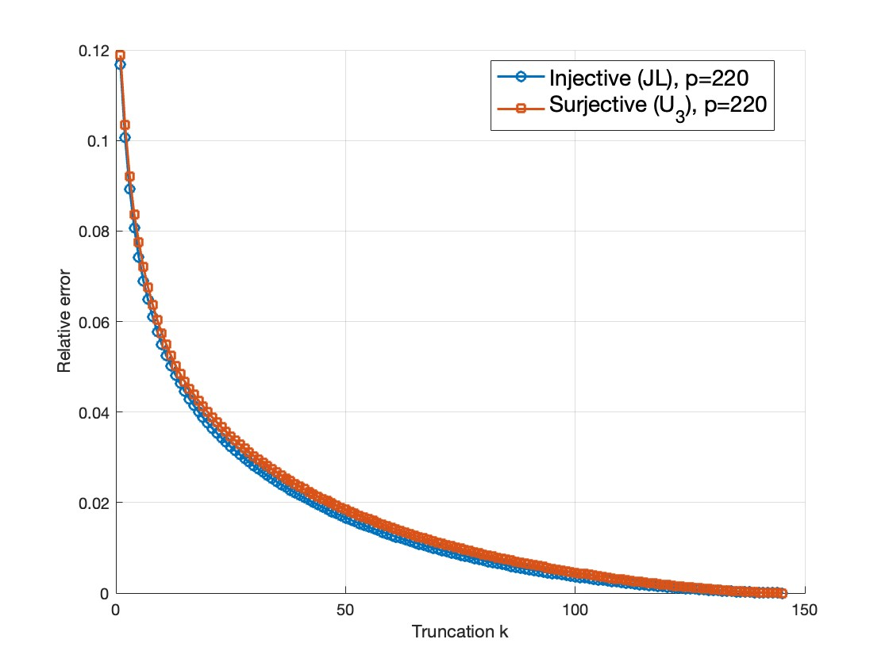

# Injective-tensor-multiplication
<p align="center"><a href="put_link_here"></a>

This reposity contains the code of the paper "Computation of Tensor Functions under Tensor-Tensor Multiplications with Linear Maps"
## Contents


* **Overview**
  - Injective SVD under a Johnson-Lindenstrauss-type embedding provides similar performance to the surjective SVD with a data-dependent matrix when the truncation $k$ is high.

    
 
* **Example Usage**: 

  
  


* **Getting Started**
  - Clone this repo:
```bash 
    git clone https://github.com/SusanaLM/Injective-tensor-multiplication.git

    cd Injective-tensor-multiplication

    setupInjectiveProduct
```    

  - Prerequisites

    MATLAB >= R2023a
       
    Image Processing Toolbox

    To run the code, first access [Hyperspectral_surjective](https://github.com/elizabethnewman/projected-products) and download the scripts: facewise.m, facewiseSVD.m, fronorm.m, modeProduct.m and tran.m.

  - Location of:
    - code: [Hyperspectral_injective MATLAB](ex_hyperspectral_injective.py)
    - issue tracker : [report issues](https://github.com/SusanaLM/Injective-tensor-multiplication/issues)


* **Notes**
  - version : v1.0


* **Colophon**
  - Credits -- code, algorithm, implementation/deployment, testing and overall direction: Susana López Moreno and Jeong-Hoon Jun.
  - Copyright and License -- see [LICENSE](https://github.com/SusanaLM/Injective-tensor-multiplication?tab=MIT-1-ov-file) file.
  - How to contribute: submit issues.
  - This work was supported by the Korea National Research Foundation (NRF) grant funded by the Korean government (MSIT) (RS-2024-00406152). J.-H. Ju was supported by the Basic Science Program of the NRF of Korea (NRF-2022R1C1C101\\ 0052) and by the Basic Research Laboratory (grant MSIT no. RS-202400414849).
  - References:  put_arxiv_link
  
* **Citation**
If you use this code for your research, please cite our paper:

```
@misc{injective_tensor_multiplication,
  title={Computation of Tensor Functions under Tensor-Tensor Multiplications with Linear Maps}, 
      author={Jeong-Hoon Ju and Susana Lopez-Moreno},
      year={2025},
      eprint={put_eprint_here},
      archivePrefix={arXiv},
      primaryClass={},
      url={put_link_here}, 
}
```
